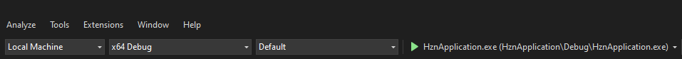

# HorizonEngine

Github repository for the 2D **HorizonEngine** (Part of Msc, ASD group project).

## Prerequisites
1. [Visual studio 2022](https://visualstudio.microsoft.com/) (Follow the *Setup for Development -> Windows* section
below. **Visual Studio build tools** and **CMake for Windows** can be installed through the process alongside the IDE
and can be primarily accessed through **Developer Command Prompt for VS 2022 / Developer Powershell for VS 2022**).

## Setup for Development
1. ### Windows
   1. Refer to the link for setting up [Visual Studio 2022 for C++ Development](https://learn.microsoft.com/en-us/cpp/build/vscpp-step-0-installation?view=msvc-170).
   2. Refer to the link for an introduction to [CMake projects in Visual Studio 2022](https://learn.microsoft.com/en-us/cpp/build/cmake-projects-in-visual-studio?view=msvc-170).
## Getting the project
1. ### Windows
   1. Run the following commands in the **command prompt / powershell** to get the project files on your local machine.
```
git clone https://github.com/TejasJD/HorizonEngine2D.git
cd HorizonEngine2D
git submodule init
git submodule update
```
## Building the project
1. ### Installing vcpkg
    1. **Peform this step before moving to next steps**.
    2. Open up the repository directory (groupProject) in **command prompt / powershell** (windows).
    3. Enter the following command in **command prompt / powershell**
to install vcpkg: `.\vcpkg\bootstrap-vcpkg.bat` (.bat file is the windows batch script. this would install vcpkg).
    4. Through this type of installation, you can use vcpkg CLI only when you are in the vcpkg directory of your project.
    5. Go to the vcpkg directory through **command prompt / powershell** and type the following command
to verify vcpkg installation: `vcpkg --version`
2. ### Windows
    1. #### Visual Studio
        1. Save the [CMakeLists.txt](CMakeLists.txt) file in this directory to configure and generate the project.
        2. Right-click on [CMakeLists.txt](CMakeLists.txt) and select the build option from the
dropdown to build the project.
        3. Select the appropriate startup item (HznApplication.exe) to run the client application.

    2. #### Visual Studio developer command prompt / powershell.
        1. Open either of the command line tools and navigate to the project directory.
        2. Run the following commands in **Developer Command Prompt for VS 2022 / Developer Powershell for VS 2022**. Two presets are available in
the [CMakePresets.json](CMakePresets.json) file. *x64-debug* and *x64-release*. The command below would configure and generate the project based on the preset
provided to the `--preset` option. Command: `cmake --preset x64-debug`
        3. Run the following command to build the project: `cd bin\build\x64-debug` and `cmake --build .`
        4. Run the following command to run the client application: `cd HznApplication\Debug` and then `HznApplication.exe` (or the following for powershell `cd HznApplication\Debug` and then `.\HznApplication.exe`).
        5. (Grouped up):
```
cmake --preset x64-debug
cd bin\build\x64-debug
cmake --build .
cd HorizonEditor\Debug
.\HznEditor.exe
```
## Adding Dependencies
1. Dependencies can be searched on the [vcpkg package browser](https://vcpkg.io/en/packages.html).
Alternatively, you can open the vcpkg directory in the project, through
command line and write `vcpkg search <package-name>`
to find out the name of any dependency.
2. To add a dependency, add it to the **dependencies** field in the
[vcpkg.json](vcpkg.json) file with the appropriate name.
3. Update the appropriate *CMakeLists.txt* file with commands of
following format:
```
find_package(<dependency-name> CONFIG REQUIRED)
target_link_libraries(<target-name> PUBLIC <dependency-name>)
```
4. A hint is provided as to what the appropriate names to be supplied
to the above two commands are upon configuring the *CMakeLists.txt* file
(the configuration first checks (if already installed) and installs the packages added to [vcpkg.json](vcpkg.json)
and then continues configuring the rest of the project).

## References
- Game Engine - YouTube. (n.d.). Www.youtube.com. Retrieved November 1, 2022, from https://www.youtube.com/playlist?list=PLlrATfBNZ98dC-V-N3m0Go4deliWHPFwT
- TheCherno. (2020, January 13). TheCherno/Hazel. GitHub. https://github.com/TheCherno/Hazel
